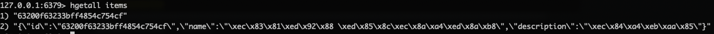

# Spring Webflux 기반 룩-어사이드(Look-aside) 캐시 패턴 구현

## 룩-어사이드 캐시 패턴이란?

## 구현 코드

```kotlin
suspend fun retrieve(id: String): Item {
    return reactiveRedisTemplate.opsForHash<String, Item>().get("items", id)
        .switchIfEmpty {
            retrieveAndPut(id)
        }
        .awaitSingle()
        ?: throw ServiceRuntimeException("$id not found")
}

private fun retrieveAndPut(id: String): Mono<Item> {
    return itemRepository.findById(id)
        .retryRandomBackoff(3, Duration.ofMillis(100L), Duration.ofMillis(1000L))
        .flatMap { item ->
            reactiveRedisTemplate.opsForHash<String, Item>().put("items", id, item).map { item }
        }
}
```

## 개선점

만약 여러 Document에 대해서 적용이 필요하다면 retrieveAndPut 코드가 여기저기 존재할 것이다.  
AOP를 적용하면 어떨까?

```kotlin
data class LookAsideDocumentId(
    val entityId: String,
    val documentId: String,
)

@Service
class Service(private val itemRepository: ItemRepository) {
    @LookAside
    suspend fun retrieveWithApo(
        id: LookAsideDocumentId,
    ): Mono<Item> {
        return itemRepository.findById(id.documentId)
    }
}

@Around(value = "@annotation(me.taesu.lookasidecachedemo.app.aop.LookAside)")
fun lookAside(
    joinPoint: ProceedingJoinPoint
): Any {
    val argument = joinPoint.args.filterIsInstance(LookAsideDocumentId::class.java).firstOrNull()
        ?: throw IllegalArgumentException("")
    val entityId = argument.entityId
    val documentId = argument.documentId

    return reactiveRedisTemplate.opsForHash<String, Any>().get(entityId, documentId).switchIfEmpty {
        val proceed = joinPoint.proceed() as Mono<*>
        proceed.flatMap { item ->
            reactiveRedisTemplate.opsForHash<String, Any>().put(entityId, documentId, item).map { item }
        }
    }
}
```

아래처럼 캐시가 없다면 mongo repository에 접근하여 조회 후 캐시에 적재한다.  
(docker exec -it <container-id> redis-cli)


이 상태에서 만약 레디스가 죽었다면, 500에러가 떨어질 것이다.  
그에 따라서 onErrorResume을 통해 예기치 못한 상황이 발생해도 정상 서비스가 가능하도록 오리진(mongodb)을 조회하게 한다.

```kotlin
reactiveRedisTemplate.opsForHash<String, Any>().get(entityId, documentId)
    .onErrorResume {
        joinPoint.proceed() as Mono<*>
    }
    .switchIfEmpty {
        val proceed = joinPoint.proceed() as Mono<*>
        proceed.flatMap { item ->
            reactiveRedisTemplate.opsForHash<String, Any>().put(entityId, documentId, item).map { item }
        }
    }
```

## 스프링의 캐시 추상화

Spring에선 @Cacheable 어노테이션을 통해 캐시 레이어의 추상화를 제공한다.  
직접 AOP 구현 없이 활용 가능하지 않을까?  
[Spring Look Aside Cache](https://docs.spring.io/spring-boot-data-geode-build/current/reference/html5/guides/caching-look-aside.html)
